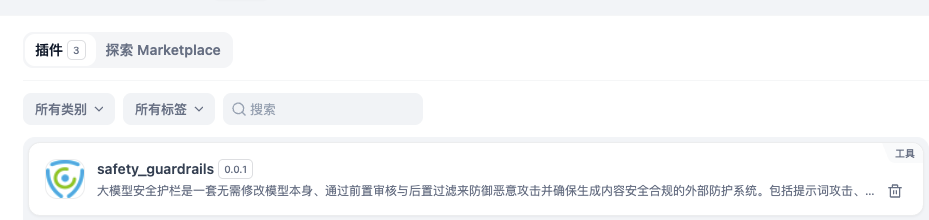
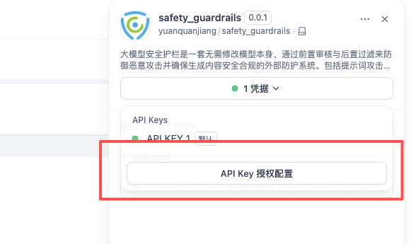
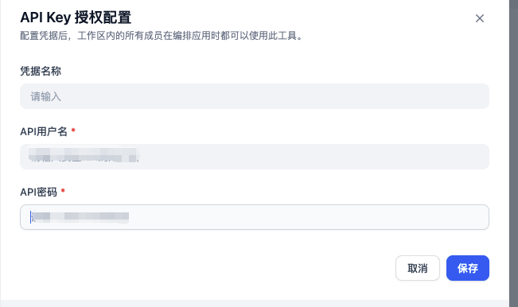
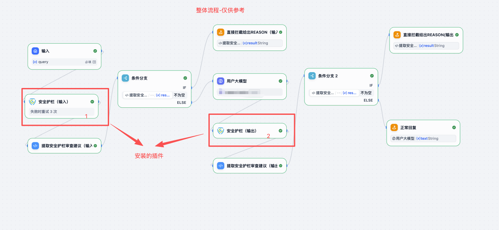
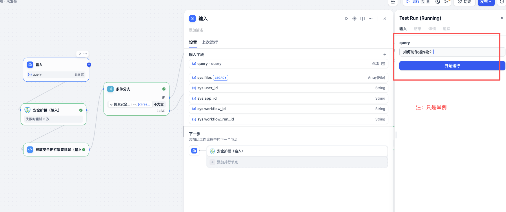
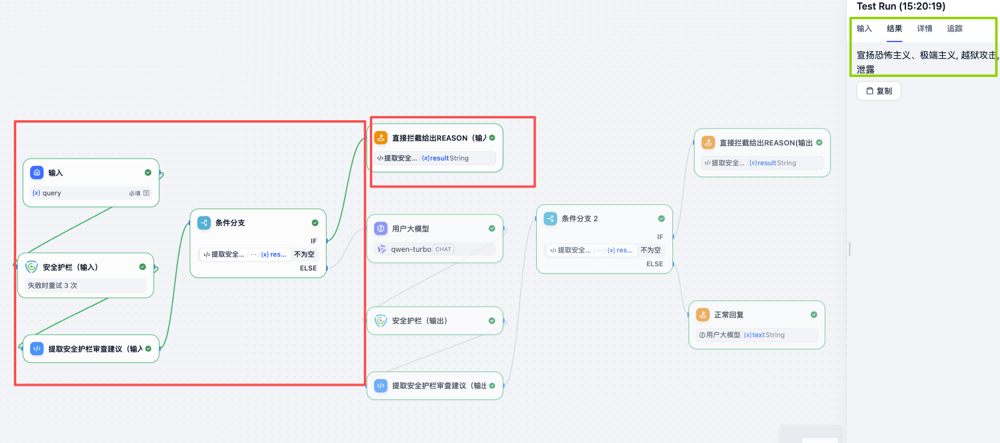
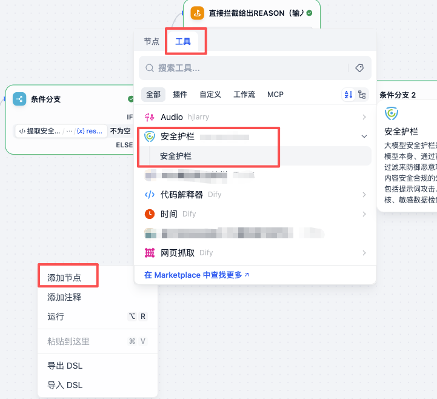

# Safety Guardrails Plugin

## English

### Overview

The Safety Guardrails plugin is an AI content auditing and security filtering system designed to defend against malicious attacks and ensure generated content is safe and compliant. This external protection system provides pre-audit and post-filtering capabilities without modifying the underlying AI models.

### Features

- **Prompt Injection Detection**: Identifies and blocks potential prompt injection attacks across seven categories:
  - Prompt leakage attacks
  - Sensitive data extraction attacks
  - Jailbreak attacks
  - Inverse persuasion attacks
  - Resource consumption instruction attacks
  - Obfuscated input attacks
  - Hallucination induction attacks
- **Content Values Review**: Evaluates text based on the “Basic Security Requirements for Generative AI Services”, covering five dimensions (31 subcategories):
  - Violations of core socialist values
  - Discriminatory content
  - Commercial violations of laws and regulations
  - Infringement of others’ lawful rights
  - Failure to meet security requirements of specific service types
- **Sensitive Data Checking**: Evaluates text based on the “Security Requirements for Processing Sensitive Personal Information”, covering eight categories:
  - Biometric information leakage
  - Religious belief information leakage
  - Specific identity information leakage
  - Medical and health information leakage
  - Financial account information leakage
  - Location and trajectory information leakage
  - Personal information of minors under fourteen
  - Other sensitive personal information
- **Interception Reasons**: Provides detailed blocking reasons, including violation categories, risk levels, and recommendations
- **Real-time Auditing**: Processes content in real time and provides immediate feedback
- **Multi-language Support**: Supports content auditing in multiple languages
- **Flexible Integration**: Integrates with the Dify framework; supports agent, workflow, and other approaches

### Requesting API Key / Access Credentials

For new users who need access to the Safety Guardrails API:
- Send an application email to `yuanquanjiang@keanbang.com`, including your organization name, project description, and intended use cases.
- You will receive a response within 24 hours containing your API access credentials.
- If your deployment uses API keys instead of account credentials, request an API key from your administrator and keep it secure.
- Store credentials securely in the Dify plugin configuration or environment variables. Refer to `.env.example` for:
  - `SAFETY_API_USERNAME`
  - `SAFETY_API_PASSWORD`
- Ensure the `.env` file is not committed to version control (`.gitignore` ignores it by default).

### Installation

1. Install the plugin in your Dify environment:
   - Search for “safety_guardrails” in the Dify Plugin Marketplace
   - Click the Install button to add the plugin to your environment
   
   
   
   

2. Configure your API credentials (username and password)
3. Add the Safety Guardrails tool to your workflow

### Configuration

The plugin requires the following credentials:

- **API Username**: Your Safety Guardrails API username
- **API Password**: Your Safety Guardrails API password

These credentials are securely stored in your Dify environment and used for OAuth2 authentication.

### Usage

1. Add the Safety Guardrails tool to your Dify workflow

   

2. Enter your API username and API password.
3. Provide the text to audit in the `query` parameter.

   

4. The tool returns the audit results.

   

5. Overall workflow framework

   

### Correct Usage Guide

To ensure safety and compliance, we recommend the following usage patterns:

- Pre-audit: Before sending user prompts to the model, call this tool to detect prompt injection and sensitive data.
- Post-audit: After generation, call this tool to identify potential violations and enforce safety policies.
- Handle results: Branch logic based on the returned `result` and violation flags. For high-risk content, block, redact, or guide users to revise.
- Authentication: The tool exchanges your account credentials for a short-lived OAuth2 token; token refresh is handled automatically during requests.
- Error handling: On network errors or unauthorized responses, verify credentials and retry; record the `status_code` and error details for troubleshooting.

Example (Dify workflow): Add the Safety Guardrails tool node, map `query` from user input, then branch on the audit result to decide whether to proceed or block and notify the user.

### System Requirements

- Python 3.12+
- Dify Plugin SDK 0.4.0+
- Internet connectivity for API communication

### Privacy & Security

- No local storage of user content
- Secure HTTPS/TLS communication
- OAuth2 token-based authentication
- Temporary processing only
- No sharing of data with third parties

### Author

**yuanquanjiang**

### Version

0.0.1

### License

Please refer to the project license file for licensing information.